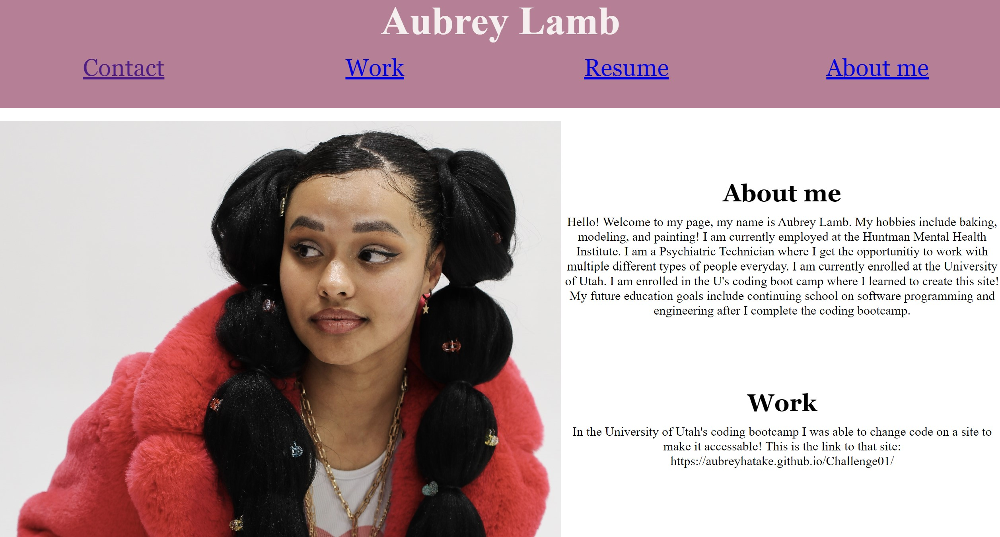

# Professional-Portfolio
This site contains my resume and work experience to help future employers to better get to know me. 
A lot of this site does not include much work, this is due to not having much work to display, yet! 

## User Story 

AS AN employer
I WANT to view a potential employee's deployed portfolio of work samples
SO THAT I can review samples of their work and assess whether they're a good candidate for an open position

## Acceptance Criteria 

GIVEN I need to sample a potential employee's previous work
WHEN I load their portfolio
THEN I am presented with the developer's name, a recent photo or avatar, and links to sections about them, their work, and how to contact them
WHEN I click one of the links in the navigation
THEN the UI scrolls to the corresponding section
WHEN I click on the link to the section about their work
THEN the UI scrolls to a section with titled images of the developer's applications
WHEN I am presented with the developer's first application
THEN that application's image should be larger in size than the others
WHEN I click on the images of the applications
THEN I am taken to that deployed application
WHEN I resize the page or view the site on various screens and devices
THEN I am presented with a responsive layout that adapts to my viewport

## My HTML 
 In this site I was able to play around with formatting on HTML to create a portfolio to display future applications and deployed websites. 
I was able to work on this assignment independently, meaning I coded everything from scratch! 

## My page 
This is a screenshot of my page: 

In this page you will be able to access my contact information, resume, information about myself, and websites I've delpoyed. 

https://aubreyhatake.github.io/Professional-Portfolio/

